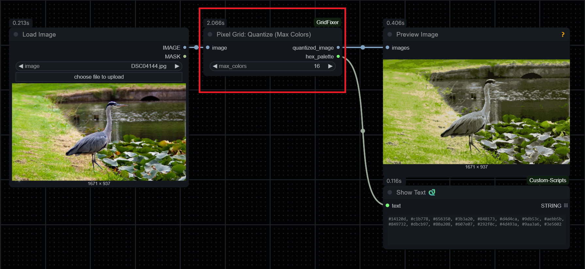
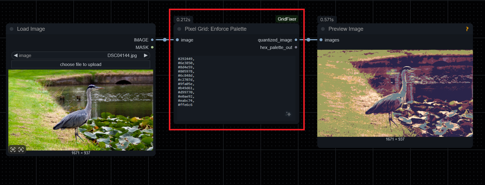
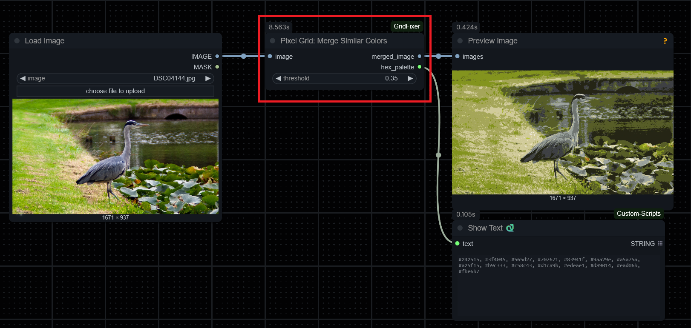
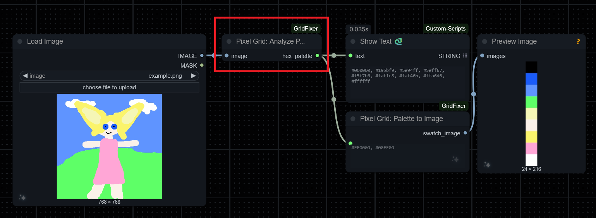
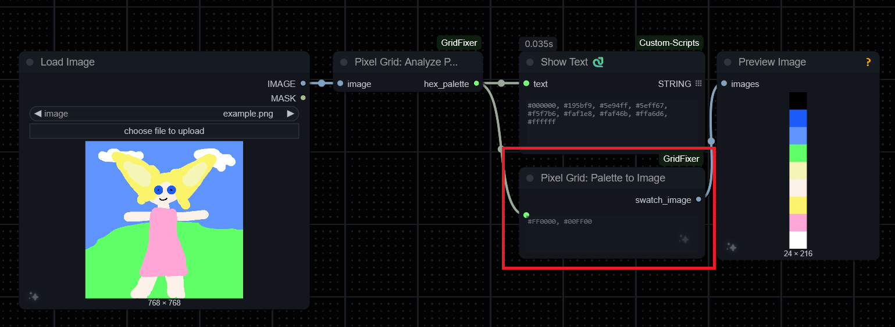
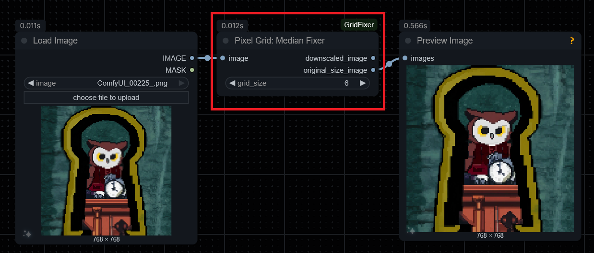

# ComfyUI Pixel Grid Helpers

A suite of custom nodes for ComfyUI designed to assist with pixelized image generation and processing. These nodes provide functionality for color quantization, palette enforcement, and grid-based image cleaning without requiring external dependencies beyond the standard ComfyUI environment.

## Installation

### Method 1: ComfyUI Manager
1. Open ComfyUI Manager.
2. Search for "Pixel Grid Helpers".
3. Install the node pack and restart ComfyUI.

### Method 2: Manual Installation
1. Navigate to your ComfyUI `custom_nodes` directory.
2. Clone this repository:
   ```bash
   git clone https://github.com/molbal/ComfyUI-PixelGridHelpers.git
````

### Method 3: Comfy CLI Installation
1. Go to the ComfyUI Root directory
2. Execute:
```bash
comfy node install comfyui-pixelgrid-helpers
```

Restart ComfyUI and refresh the browser after installation.

## Node Reference

### 1. Pixel Grid: Quantize (Max Colors)

Reduces the colors in an image to a specified maximum number (N) using K-Means clustering. It automatically generates a palette based on the image content.

  * **Inputs:**
      * `image`: The input image.
      * `max_colors`: The target number of colors (e.g., 16).
  * **Outputs:**
      * `quantized_image`: The image reduced to the target color count.
      * `hex_palette`: A comma-separated string of the generated HEX color codes.




### 2. Pixel Grid: Enforce Palette

Takes an input image and forces every pixel to match the nearest color in a provided HEX palette.

  * **Inputs:**
      * `image`: The input image.
      * `hex_palette`: A comma-separated string of HEX codes (e.g., `#FF0000, #00FF00, #0000FF`).
  * **Outputs:**
      * `quantized_image`: The image re-colored using only the provided palette.
      * `hex_palette_out`: Passthrough of the input string.



### 3. Pixel Grid: Merge Similar Colors

Merges colors that are visually similar based on a threshold. This is useful for cleaning up noise where multiple shades of the same color exist unintentionally in pixel art.

  * **Inputs:**
      * `image`: The input image.
      * `threshold`: A float value (0.0 to 1.0) defining how close colors must be to merge. Higher values merge more colors.
  * **Outputs:**
      * `merged_image`: The processed image.
      * `hex_palette`: The palette of the resulting image.



### 4. Pixel Grid: Analyze Palette

Analyzes an image and extracts all unique colors as a HEX string.

  * **Inputs:**
      * `image`: The input image.
  * **Outputs:**
      * `hex_palette`: A comma-separated string of all unique colors found in the image.




### 5. Pixel Grid: Palette to Image

Generates a visual representation of a color palette. It creates a vertical stack of 24x24 pixel color swatches based on the input HEX string.

  * **Inputs:**
      * `hex_palette`: A comma-separated string of HEX codes.
  * **Outputs:**
      * `swatch_image`: An image output showing the colors stacked vertically.



### 6. Pixel Grid: Median Fixer

Designed for upscaled pixel art where logical pixels (blocks) are comprised of smaller physical pixels (e.g., a 6x6 grid). It calculates the median color of each grid block to remove noise or upscaling artifacts.

  * **Inputs:**
      * `image`: The input image.
      * `grid_size`: The size of the logical pixel grid (default: 6).
  * **Outputs:**
      * `downscaled_image`: The image downscaled to its true resolution (1 pixel per logical block).
      * `original_size_image`: The image reconstructed at the original resolution, with clean, solid grid blocks.


