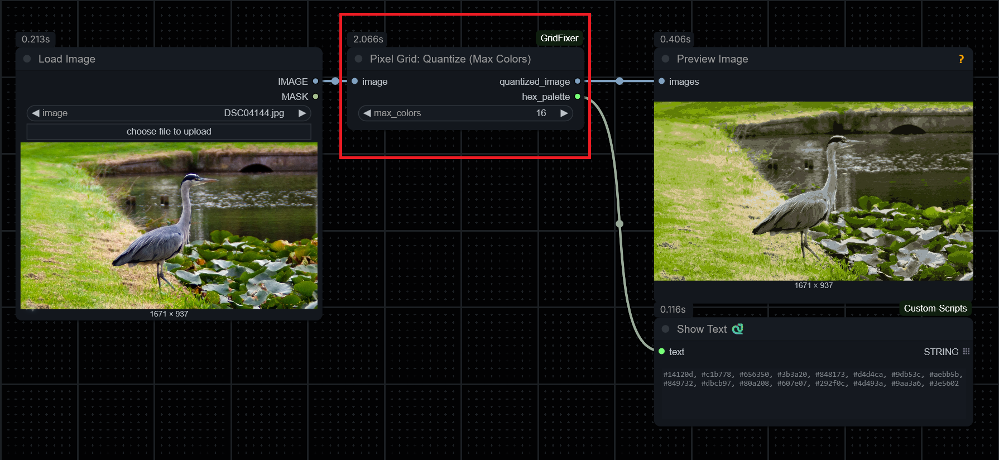
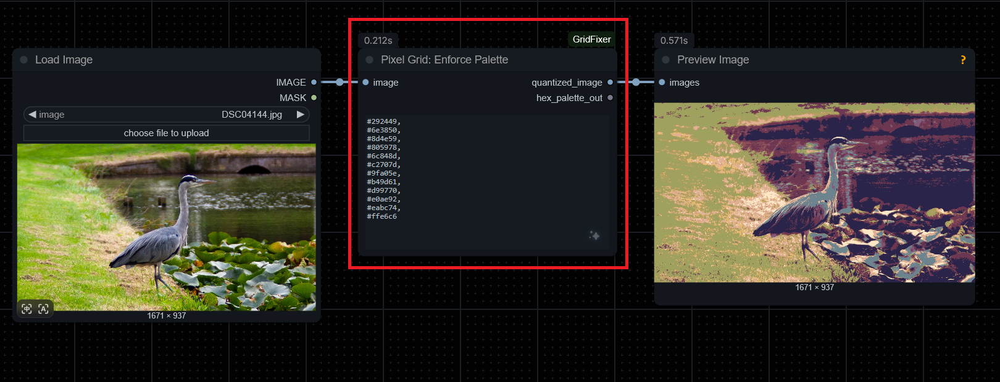
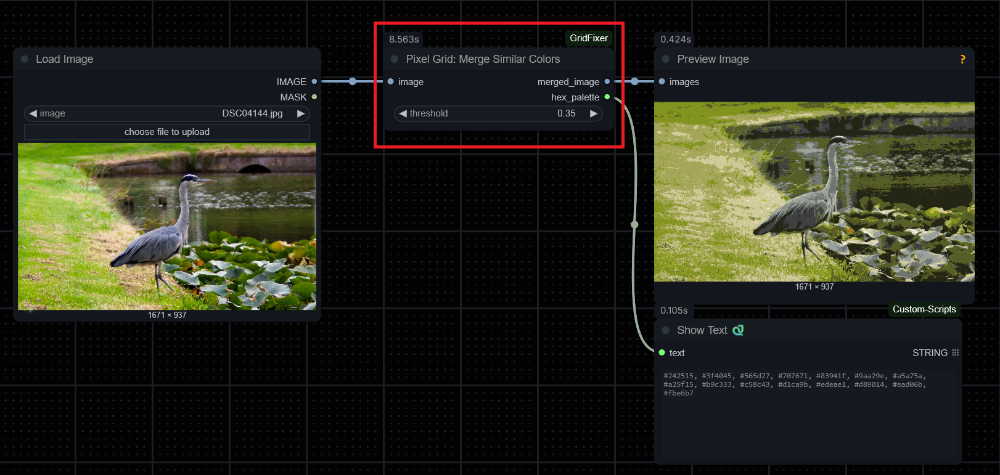
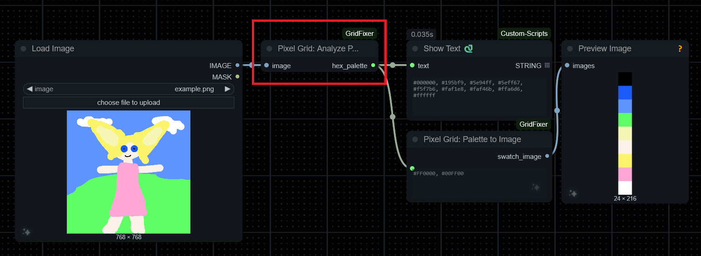
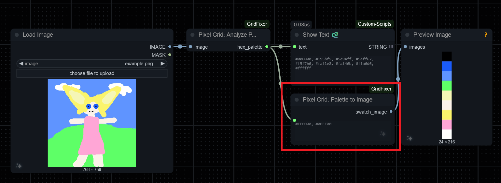
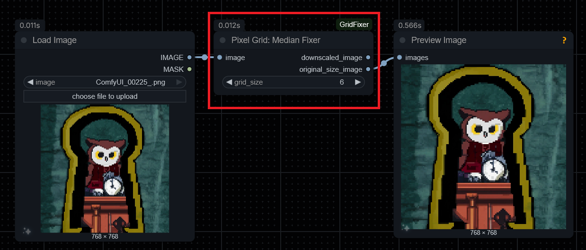

# ComfyUI Pixel Grid Helpers

A suite of custom nodes for ComfyUI to clean up pixel art, reduce color counts,
reuse palettes, and turn HEX colors into readable names. No extra dependencies
are needed beyond the standard ComfyUI environment.

## Installation

### Method 1: ComfyUI Manager

1. Open ComfyUI Manager.
2. Search for "Pixel Grid Helpers".
3. Install the node pack and restart ComfyUI.

### Method 2: Manual Installation

1. Navigate to your ComfyUI `custom_nodes` directory.
2. Clone this repository:

```bash
git clone https://github.com/molbal/ComfyUI-PixelGridHelpers.git
```

### Method 3: Comfy CLI Installation

1. Go to the ComfyUI root directory.
2. Execute:

```bash
comfy node install comfyui-pixelgrid-helpers
```

Restart ComfyUI and refresh the browser after installation or updates.
Find the nodes under **Pixel Grid Helpers** in the node menu.

## Node Reference

### 1. Pixel Grid: Quantize (Max Colors)

Reduce an image to a smaller palette. Use this when generated artwork has too many
shades, or when preparing a sprite for a limited-color style.

Connect an image and set `max_colors` to your desired color count, such as 16.
Lower values give a simpler look; higher values retain more shading.

| Input | Usage |
| --- | --- |
| `image` | The image to simplify. |
| `max_colors` | The target maximum number of colors. |

| Output | Usage |
| --- | --- |
| `quantized_image` | The image with its colors reduced. |
| `hex_palette` | A comma-separated HEX palette to reuse in other nodes. |



### 2. Pixel Grid: Enforce Palette

Recolor an image using only your chosen colors. Use this to keep several sprites
consistent, apply a game's palette, or match a reference image.

Connect an image and enter a `hex_palette`, such as `#FF0000, #00FF00, #0000FF`.
You can also connect a palette from Analyze Palette, Quantize, or Autofixer.

| Input | Usage |
| --- | --- |
| `image` | The image to recolor. |
| `hex_palette` | The comma-separated HEX colors the image is allowed to use. |

| Output | Usage |
| --- | --- |
| `quantized_image` | The image recolored to the supplied palette. |
| `hex_palette_out` | The supplied palette, ready to connect to another node. |



### 3. Pixel Grid: Merge Similar Colors

Combine nearly identical shades to clean up unwanted color variation. Use this
when pixel art contains many slightly different colors that should look the same.

Start with a low `threshold` and increase it gradually. Higher values merge more
colors and can remove shading you want to keep.

| Input | Usage |
| --- | --- |
| `image` | The image to clean up. |
| `threshold` | How aggressively to merge similar colors, from 0.0 to 1.0. |

| Output | Usage |
| --- | --- |
| `merged_image` | The image with similar shades combined. |
| `hex_palette` | The resulting comma-separated HEX palette. |



### 4. Pixel Grid: Analyze Palette

Extract every unique color from an image. Use this to inspect a sprite's colors
or borrow the palette from a reference image.

Connect `hex_palette` to Enforce Palette to recolor another image, Palette to Image
to preview the colors, or HEX to Color Names to describe them.

| Input | Usage |
| --- | --- |
| `image` | The image whose colors you want to extract. |

| Output | Usage |
| --- | --- |
| `hex_palette` | A comma-separated list of all unique HEX colors in the image. |



### 5. Pixel Grid: Palette to Image

Preview a palette as a vertical stack of 24-by-24-pixel color swatches.
Use this to compare palettes or check colors before applying them to artwork.

Enter HEX colors directly or connect a palette output, then connect `swatch_image`
to Preview Image or Save Image.

| Input | Usage |
| --- | --- |
| `hex_palette` | The comma-separated HEX colors to preview. |

| Output | Usage |
| --- | --- |
| `swatch_image` | An image showing one color swatch per palette entry. |



### 6. Pixel Grid: Median Fixer

Clean up enlarged pixel art with noisy or uneven pixel blocks. Use this when
each logical pixel occupies a known square block, such as 6 by 6 image pixels.

Set `grid_size` to the block size. The node tests each horizontal and vertical
grid offset that leaves at least one complete block, then chooses the alignment
with the lowest mean absolute RGB error from each pixel to its block median.
This favors alignments where pixels within each logical block are most
consistent; equal scores prefer the top-left alignment. Scoring uses the region
covered by all candidate alignments, so incomplete edge fragments do not bias
the comparison.

The selected leading offset and any incomplete trailing blocks are cropped.
Use `downscaled_image` for native-resolution editing, or `original_size_image`
to keep the selected grid enlarged as solid blocks. Output dimensions can differ
from the input. The exhaustive phase search costs `grid_size` squared candidate
alignments, so larger block sizes take longer; scoring runs on the input device,
including the GPU when available.

| Input | Usage |
| --- | --- |
| `image` | The enlarged pixel-art image. |
| `grid_size` | The width and height of each logical pixel block; default: 6. |

| Output | Usage |
| --- | --- |
| `downscaled_image` | The cleaned image at one pixel per logical block. |
| `original_size_image` | The cleaned image enlarged back to the cropped input size. |



### 7. Pixel Grid: Autofixer

Clean up generated or enlarged pixel art in one step: recover the pixel grid,
limit the palette, and remove small stray color specks. It aims to keep small
details such as eyes and jewelry while simplifying the rest of the image.

Connect an image and start with the defaults: automatic pixel-size detection,
12 colors, and ink-preserving sampling. If the grid looks wrong, set `pixel_size`
to the known block size. Use `1` for artwork already at its native resolution.
Increase `colors` if important shading or details disappear.

| Input | Usage |
| --- | --- |
| `image` | The image to clean up. |
| `pixel_size` | `0` detects the block size automatically; `1` keeps the native grid; larger values specify the block size. |
| `palette` | Optional comma-separated HEX colors, such as `#000000, #8B4513, #F2B9A0, #00FF00`. Leave blank to generate a palette. A supplied palette overrides `colors`. |
| `sampling` | Choose how to turn each enlarged block into a single pixel; see below. |
| `colors` | The maximum generated palette size, from 2 to 256 colors; default: 12. |

Choose **Exact pixels - existing pixel art** for already-crisp enlarged artwork,
**Ink-preserving - thin dark lines** for outlines and linework,
**Crisp shapes - clean color boundaries** for flat shapes, or
**Area coverage - softer detail** for softer shading.

| Output | Usage |
| --- | --- |
| `fixed_image` | The cleaned image at the input dimensions, ready to preview or save. |
| `hex_palette` | The resulting palette, ready to preview, name, or apply to another image. |
| `pixel_size_used` | The detected or supplied block size, useful when checking automatic detection. |

### 8. Pixel Grid: HEX to Color Names

Turn a HEX palette into a readable color description. Use this to describe
a sprite's palette, prepare color wording for a prompt, or make a palette easier
to discuss without reading HEX codes.

Connect `hex_palette` from Analyze Palette, Quantize, Merge Similar Colors, or
Autofixer, or type a comma-separated list directly.

| Input | Usage |
| --- | --- |
| `hex_palette` | Comma-separated three- or six-digit HEX colors, with or without `#`. |

| Output | Usage |
| --- | --- |
| `color_names` | Comma-separated distinct color names, in first-occurrence order. |

```text
Input:  #FF0000, #00FF00, #123456, #FF0000
Output: Red, Lime, Muted Deep Blue
```

Different HEX colors can receive the same name; each name appears only once.
Colors without an exact named match receive the closest available name.
Whitespace and empty entries are ignored; malformed HEX colors raise an error.

### 9. Pixel Grid: Create Solid Color Image

Create an image filled with one HEX color. Set the output dimensions and enter
a three- or six-digit HEX color, with or without the leading `#`.

| Input | Usage |
| --- | --- |
| `width` | Output image width in pixels. |
| `height` | Output image height in pixels. |
| `hex_code` | HEX color to fill the image with; default: `#FF0000`. |

| Output | Usage |
| --- | --- |
| `image` | The generated solid-color image. |

## Example Workflows

- **Clean generated pixel art:** Image -> Autofixer -> Preview Image or Save Image.
- **Reuse a reference palette:** Reference image -> Analyze Palette -> Enforce Palette's `hex_palette`; connect your artwork to Enforce Palette's `image`.
- **Inspect and describe colors:** Connect any `hex_palette` output to Palette to Image for swatches and HEX to Color Names for readable names.
- **Recover a known pixel grid:** Image -> Median Fixer -> use `downscaled_image` for editing or `original_size_image` for an enlarged result.
- **Create a flat background:** Create Solid Color Image -> Preview Image or combine it with another image.

## Attribution

The workings of **Pixel Grid: HEX to Color Names** are based on
[Solvioza's Color Name Finder](https://www.solvioza.com/tools/color-name-finder/).

**Pixel Grid: Autofixer** is based on the pixel-art fixer from
[Portal Rabbit](https://portalrabbit.com/).
